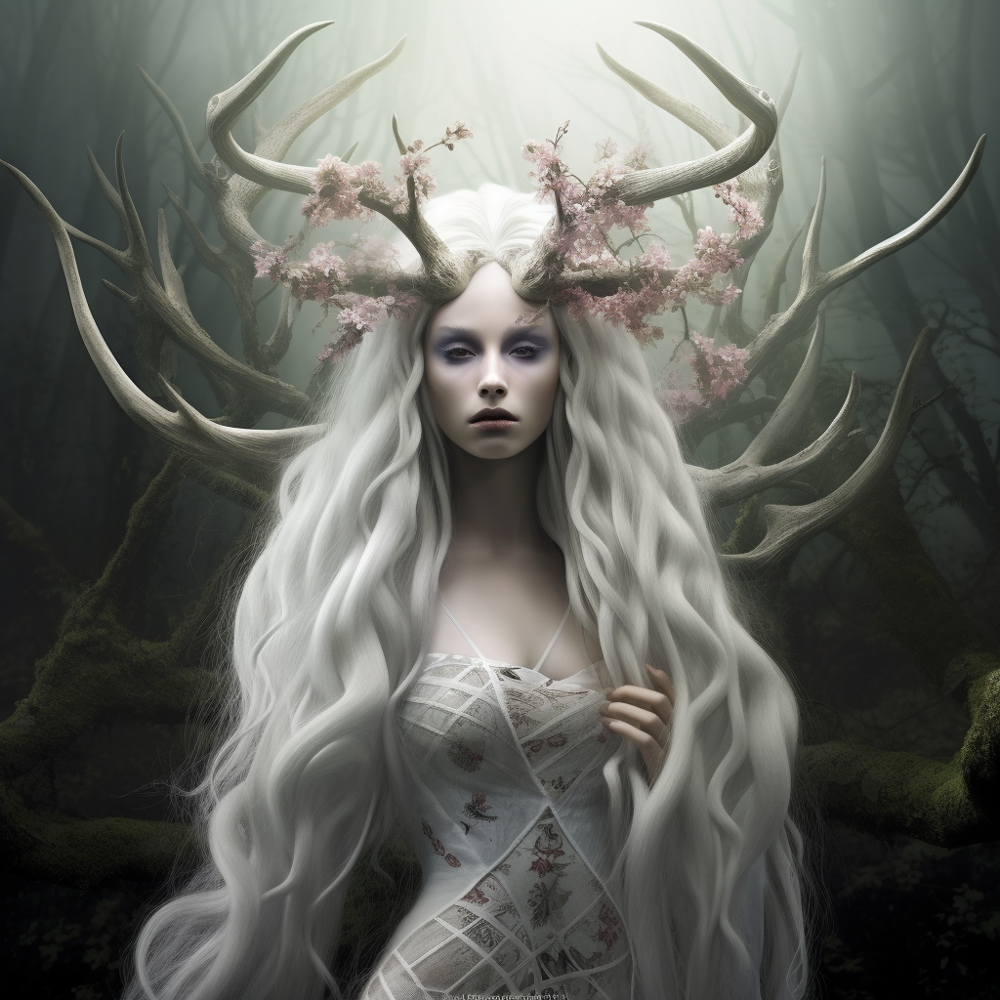
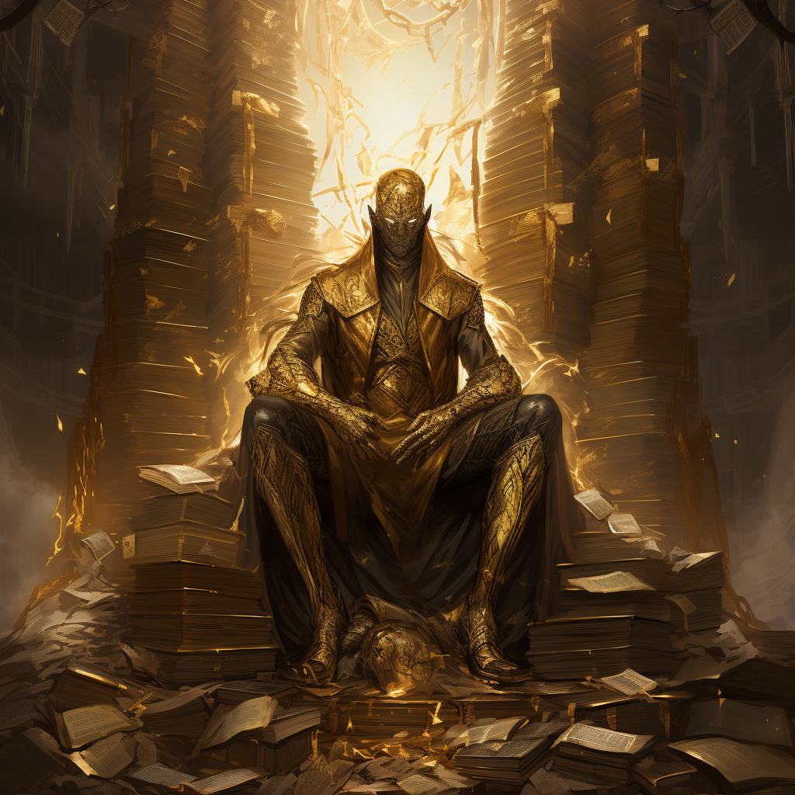
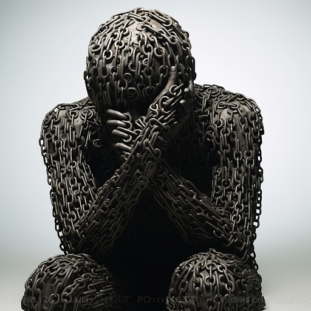
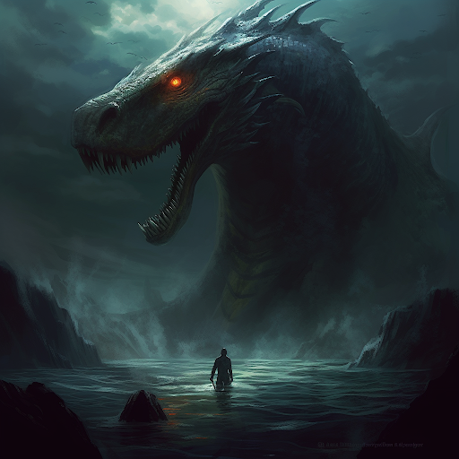
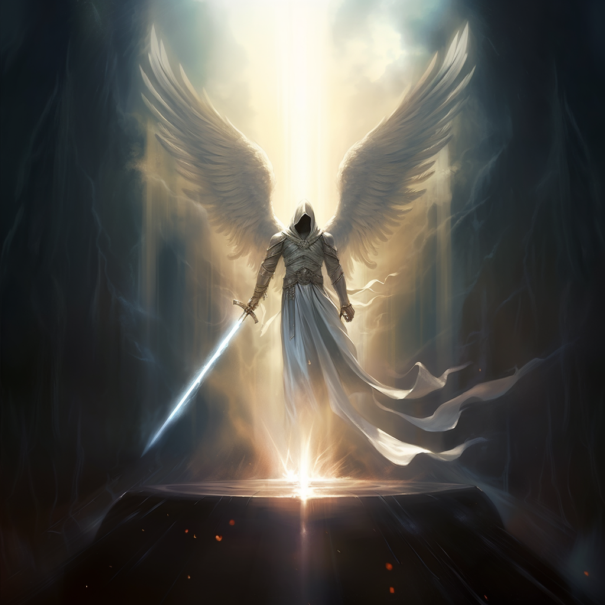
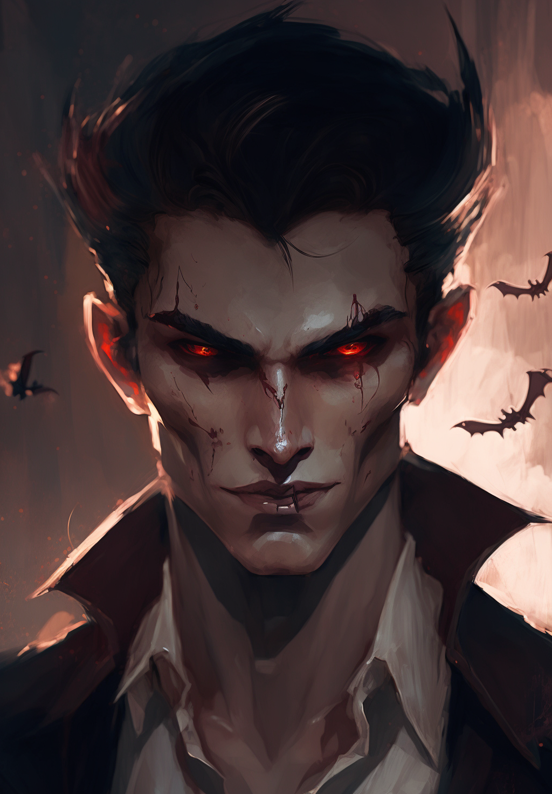

## Creation Myth

### The Awakening

On dead world, at the end of time, life begins once again…

This world, known as Terra, revolves around a faded and dying star. Once, it was a flourishing world teeming with consciousness and vibrant life. However, it has now become a fallen apocalyptic realm, where only malevolent creatures roam. Their ceaseless hunt driven by the hunger for the conscious life that has long since vanished into oblivion. It drifts ceaselessly through the vast expanse of space, an eternal voyage through boundless void and darkness.

However, a turning point emerged when a celestial entity, known as "the Bright Lord," descended upon Terra, accompanied by other ethereal beings referred to as the Brights or gods in various cultures. Moved by the plight of the mindless monstrosities that roamed the planet, the Bright Lord felt compassion for this lifeless realm. With a benevolent touch, he granted consciousness to those creatures that bowed before him, bestowing upon them the humanoid form akin to his own. This pivotal event came to be known as "The Awakening."

To aid the newly awakened beings in their struggle to survive and thrive in this harsh new world, each of the Brights imparted a unique aspect of themselves. These guiding principles, known as the Tenets of the Awakening, became the foundations upon which Fellkind would navigate their existence:

The Beautiful One declared, "Thou has been given the passion of flesh to spread across the land."

The Ravenous One commanded, "Thou shall indulge and consume of the world that I have granted."

The Bargainer proclaimed, "Thou shall seek prosperity in the wealth and secrets of the land."

The Bound One decreed, "Thou shall go without care for the opinions of the world."

The Faithful One vowed, "Thou shall take up arms and seek righteous vengeance upon those who have betrayed and wronged you."

The Twisting One affirmed, "Thou shall recognize the success of one's neighbor and strive to attain greatness for oneself."

And finally, the Bright Lord himself spoke, "Thou are created in the image of greatness, and shall seek strength, knowledge, and greatness to be closer to I, but shall recognize thine greatness is from within thine own labors."

Through this transformative event, a multitude of beings came into existence. The Bright Lord named these being "Fellkin", as they were of a fallen world.

 Despite assuming humanoid forms, Fellkind retained the ability to tap into the genetic traits inherited from their monstrous origins. Fellkind learned to harness ichor, the potential energy held in the blood of monsters and Fellkind alike. As the gifted and disciplined among them delved deeper into their newfound powers, they shaped and refined these abilities, giving birth to what is now recognized as Fellcraft.

### The First of Brightkind

With a divine touch, the Bright Lord bestowed the blessing upon the most devoted daughters of Fellkind his offspring.These were the first demi-brights or Brightkin.

The Bright Lord proclaimed their rightful dominion over Terra and Fellkind to his offspring, though they would have to seize their claim through their own endeavors. Unlike their Fellkind brethren, Brightkind bore no trace of monstrous traits. They possessed the extraordinary ability to perform Miracles, akin to the Bright Lord himself. While Fellcraft adhered to the natural laws of the world, Miracles appeared to regard them as mere suggestions, perplexing scholars to this very day. Immortality coursed through the veins of Brightkin, much like their celestial progenitor, rendering them virtually impervious to permanent demise.

### Brightinism

The Bright Lord imparted his teachings upon both Fellkind and Brightkind, establishing a spiritual path known as Brightinism. Central to this belief system was the solemn warning of the Dead God, an ancient entity responsible for the forsaken state and cataclysmic demise of the previous world. The Bright Lord strictly forbade the worship of the Dead God, for it was prophesied that such reverence would summon the entity back into existence, triggering another devastating rapture. In order to guide his devoted followers, the Bright Lord bestowed upon them profound visions, serving as beacons of enlightenment and direction for his Brightinist followers.

### The Faithful One

Bathed in near endless night resulting from the fading star, the newly created inhabitants of Terra were hunted by the monsters of Terra. The Bright Lord entrusted the protection of his new creations to his most loyal companion, the bright Amon, known as the Faithful One, the bearer of the Mark of the Undying. Amon taught Fellkin and Brightkin how to defend themselves, construct weapons, and dwelled among them. Through his time among them, Amon developed a deep affection for Fellkind.

When the remaining Demon Lords of Terra began preying upon Fellkind, Amon embarked on a relentless war against them. Wielding the formidable Spear of Destiny, he waged a campaign of rampage and pursuit, extinguishing the existence of demons from Terra.

However, unsatisfied with the mere possibility of their return, Amon ventured to the very realm of the demons. There, he unleashed unyielding fury, tearing through their world with unrestrained might. Legends speak of Amon's boundless rage echoing across the demon realm for an eternity, all driven by his unwavering commitment to protecting those he cherished. The demons, recognizing his indomitable power, bestowed upon him the title of "The Demon of the West," for in time they considered him one of their own. Yet, upon his return, Amon had been forever changed.

From that moment forward, the demons never dared to set foot on Terra again, for the only thing they feared was him.

### The Great Betrayal

The motives behind Amon, the Faithful One, attempting to overthrow the Bright Lord remain shrouded in uncertainty. Some believe that he was tainted by the influence of the Dead God, while Brightinist priests often assert that it was a manifestation of the Tenets themselves and a deliberate test of the Bright Lord's will. According to tales passed down through generations, their epic clash was so cataclysmic that it fractured the moon into two distinct celestial bodies.

Ultimately, Amon met his defeat and was imprisoned. In the wake of this treacherous act, the Bright Lord decreed that henceforth, Amon would be forever referred to as "The Great Betrayer." This significant event became known as "The Great Betrayal." In the aftermath, the Bright Lord imparted upon his followers the Tenets of Fear, further shaping their beliefs and guiding their path in the world.

- _"Fear the return of the Dead God"_
- _"Fear the indelible mark of the Undying"_
- _"Fear all tyrants, for true freedom should know no bounds"_

### The Ascension of the Bright Lord

Devoid of light, the people of Terra suffered immensely to the horrors that lurk in the endless darkness. And so, after the Great Betrayal, the Bright Lord ascended to the heavens. High above, the Bright Lord took upon himself the eternal task of tending to the heart of the dying star, infusing it with his own vitality and radiance. From this celestial vantage point, the Bright Lord keeps a vigilant eye over his beloved creations, ever watchful and protective. This act began the Radiant Cycle, the gradual fading over many months towards a red star before being revitalized to a pristine condition in an act of brilliant heavenly radiance.

As the Bright Lord ascended, the remaining Brights on Terra established their own sects within the realm of Brightinism. This diversification led many individuals to embrace the role of priest or priestess,  pursuing a sacred path of devotion and guidance under a particular Bright.

The Bright Lord's Ascension marked the age, later referred to as the Dark Age, and was the founding of a new age, the Dawn Age.
